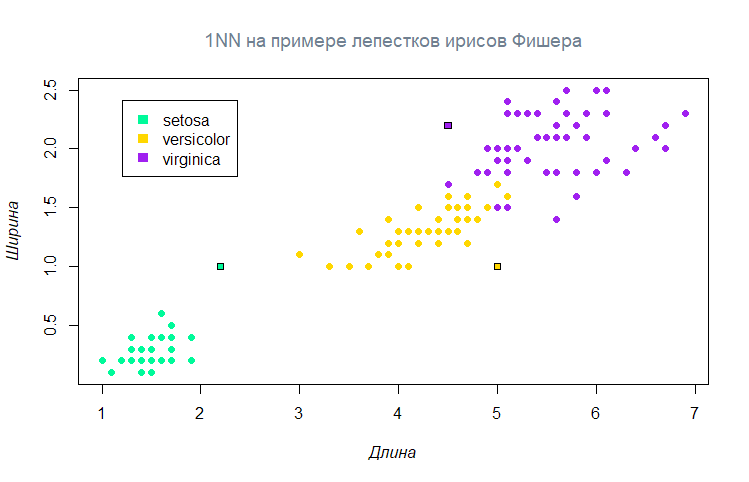

# Алгоритм ближайшего соседа

Простейший из **метрических алгоритмов классификации**.

Данный метод находит ближайший к классифицируемому объекту объект выборки и относит к тому классу, к которому принадлежит найденный ближайший объект.

## Реализация алгоритма

``` R
NN <- function(xl, z, metricFunction = euclideanDistance) {

    # Вычисление расстояния каждого объекта выборки до классифицируемого объекта
    distances <- c()
    for (i in 1:dim(xl)[1]) 
        distances[i] <- euclideanDistance(c(xl[i, 1], xl[i, 2]), z)
    
    # Вычисление объекта с минимальным расстоянием и возвращение его класса
    return(xl[which.min(distances), 3])
}
```



**Достоинства**
+ Быстрая и простая реализация

**Недостатки**
- Нет параметров
- Качество результата сильно зависит от метрики
- Хранение всей выборки